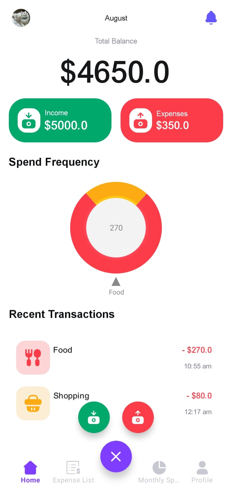
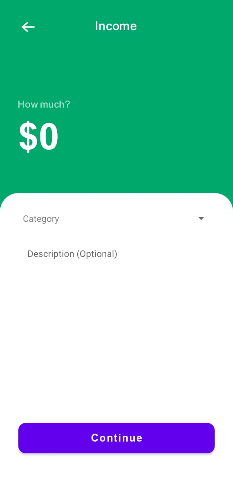
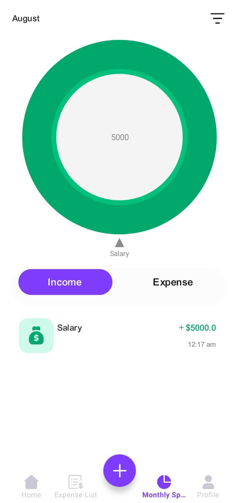
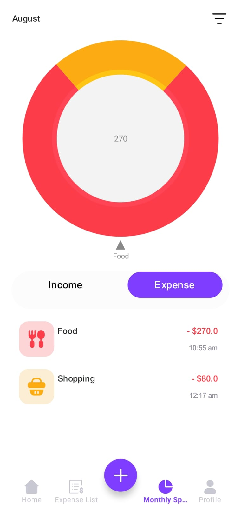
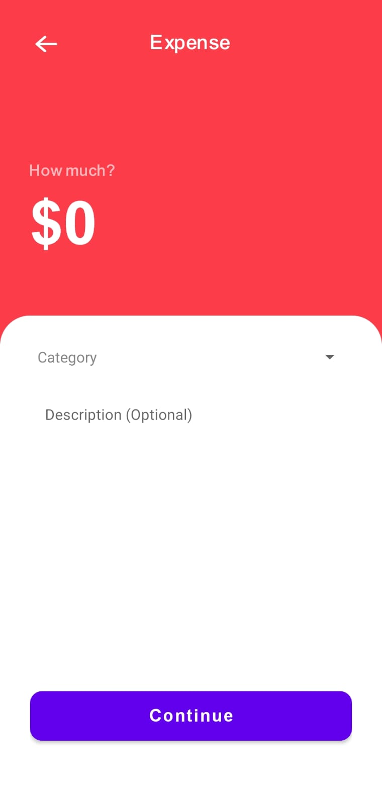

# 💰 BudgetWise Expense Tracker


> A modern, offline-friendly Android app to help users track their income and expenses effortlessly.  
> Built with ❤️ using **Kotlin**, **Room Database**, and **MVVM architecture**.

---

## ✨ Features

- 📌 Track **income & expenses** with category and amount  
- 📊 View **real-time pie charts** of your spending habits  
- 📶 Fully **offline support** with a local Room database  
- 🧠 Clean **MVVM architecture** for scalability  
- 🖌️ Sleek, intuitive **Material Design UI**

---

## 🛠️ Tech Stack

| Layer         | Technology            |
|---------------|------------------------|
| Language       | Kotlin                 |
| Architecture   | MVVM                   |
| Database       | Room (Jetpack)         |
| UI             | Material Components    |
| State Handling | LiveData + ViewModel   |
| IDE            | Android Studio         |

---

## 🚀 Getting Started

### 1️⃣ Clone the repository

```bash
git clone https://github.com/Abdelrahman1atef/BudgetWiseExpenseTracker.git
cd BudgetWiseExpenseTracker
```

### 2️⃣ Open in Android Studio

Android Studio **Dolphin or newer** is recommended.

### 3️⃣ Run the app

Connect a device or start an emulator.  
Click **Run ▶** to build and deploy the app.

---

## 📷 Screenshots

| Dashboard | Add Transaction | Income Chart |
|-----------|------------------|----------------|
|  |  |  |
| Spend Chart | Spend Transaction |
|-----------|------------------|----------------|
|  |  |

---

## 🎯 Why I Built This

As someone who started coding at 13, I’ve always been fascinated with using software to solve everyday problems. **BudgetWise** is a reflection of that — combining practical financial tools with solid mobile development practices.

> “A budget is telling your money where to go instead of wondering where it went.” — *Dave Ramsey*

---

## 📬 Feedback & Contributions

I’d love your input! Feel free to:

- ⭐ Star this repo  
- 🐞 Report issues  
- 🤝 Submit pull requests  
- 💬 Suggest features  

---

## 🔗 Connect with Me

- 💼 [LinkedIn – Abdelrahman Atef](https://www.linkedin.com/in/abdelrahman-atef-b1a59b24a/)  
- 📂 [GitHub – More Projects](https://github.com/Abdelrahman1atef)

---

## 📄 License

This project is licensed under the **MIT License**. See the [LICENSE](LICENSE) file for details.

---

> Built with ❤️ by **Abdelrahman Atef** – Always learning, always building.
